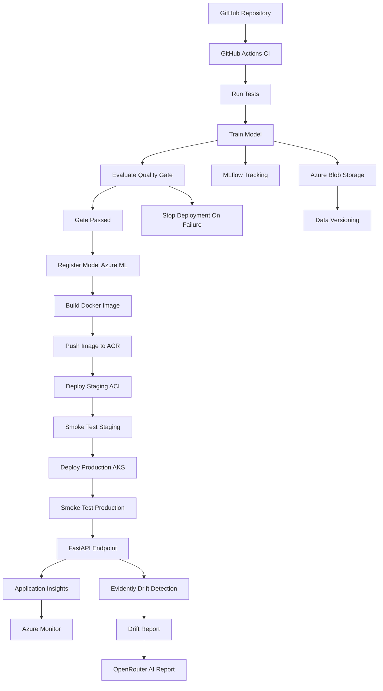

# MLOps Azure Final Project — Iris Classifier

> Author: Bakhtiyar Khan · Date: 2026-06-27
> A complete, production-grade MLOps CI/CD pipeline on Microsoft Azure.

[](https://github.com/bakhtiyark06/MLOPS-azure-final-project/actions/workflows/ci.yml)

This repository trains, validates, packages, deploys and monitors an Iris
classifier through a fully automated pipeline using **Azure ML, Azure Blob
Storage, MLflow, Docker, FastAPI, pytest, GitHub Actions, Azure Container
Registry, Azure Container Instances, Azure Kubernetes Service, Azure Monitor,
Application Insights, Evidently AI and OpenRouter**.

---

## Table of contents
1. [Project overview](#project-overview)
2. [Architecture](#architecture)
3. [Folder structure](#folder-structure)
4. [Local setup](#local-setup)
5. [Azure setup](#azure-setup)
6. [Docker setup](#docker-setup)
7. [GitHub Secrets](#github-secrets)
8. [Training](#training)
9. [Testing](#testing)
10. [Deployment](#deployment)
11. [Monitoring](#monitoring)
12. [Drift detection](#drift-detection)
13. [OpenRouter](#openrouter)
14. [Troubleshooting](#troubleshooting)
15. [Demo instructions](#demo-instructions)
16. [Submission checklist](#submission-checklist)

---

## Project overview

A push to GitHub runs **CI** (tests + coverage, data ingestion, training, the
quality gate, drift detection and an AI report). A merge to `main` runs **CD**
(Azure login → train → quality gate → register model → build & push image →
deploy to ACI staging + smoke test → deploy to AKS production + smoke test).

Every Azure integration is **lazy and optional**: the entire core loop runs on a
laptop with no Azure account. Nothing fails just because a credential is missing.

- **Language**: Python 3.11+
- **Model**: scikit-learn `RandomForestClassifier` on the Iris dataset
- **API**: FastAPI (`GET /health`, `POST /predict`)
- **Quality gate**: accuracy ≥ 0.90 (configurable), blocks deployment on failure

## Architecture



Full details: [`docs/architecture.md`](docs/architecture.md) ·
diagram source: [`docs/architecture_diagram.mmd`](docs/architecture_diagram.mmd).

## Folder structure

```
.
├── .github/workflows/      # ci.yml, cd.yml
├── app/                    # FastAPI service: main, inference, schemas
├── mlops/                  # pipeline stages (ingest, train, evaluate, ...)
├── tests/                  # pytest suite (api, inference, preprocessing, gate)
├── docs/                   # architecture, azure setup, monitoring, demo, ...
├── data/raw/ data/reference/   # generated datasets (git-ignored content)
├── models/                 # trained model.joblib (generated)
├── reports/                # metrics, confusion matrix, drift, AI report
├── Dockerfile              # lean Python 3.11 serving image
├── requirements*.txt       # runtime / dev / api dependencies
├── pytest.ini              # test + coverage config (>=70%)
└── .env.example            # documented environment variables (no secrets)
```

## Local setup

Requires Python 3.11+.

```bash
git clone https://github.com/bakhtiyark06/MLOPS-azure-final-project.git
cd MLOPS-azure-final-project

python -m venv .venv
.venv\Scripts\activate          # Windows PowerShell
# source .venv/bin/activate      # macOS / Linux

pip install -r requirements-dev.txt
cp .env.example .env             # then fill in values (optional locally)
```

Run the full pipeline locally (no Azure needed):

```bash
python mlops/ingest_data.py --no-upload
python mlops/train.py
python mlops/evaluate.py
python mlops/drift_detection.py
python mlops/openrouter_report.py
```

## Azure setup

Full provisioning commands are in [`docs/azure_setup.md`](docs/azure_setup.md).
You will create: a resource group, Azure ML workspace, Storage account +
container, Container Registry, AKS cluster, Application Insights and a service
principal for GitHub Actions.

## Docker setup

```bash
# Build the serving image (uses the lean requirements-api.txt)
docker build -t mlops-api:latest .

# Run it (model.joblib is baked into the image)
docker run -p 8000:8000 mlops-api:latest
# -> http://localhost:8000/docs
```

Automated build + push to ACR:

```bash
python mlops/build_container.py            # build + push (needs ACR + az)
python mlops/build_container.py --no-push  # local build only
```

> **Docker Desktop must be running** for any `docker` command to work.

## GitHub Secrets

Set these under **Settings → Secrets and variables → Actions**:

| Secret | Purpose |
|--------|---------|
| `AZURE_CLIENT_ID` | Service principal app id |
| `AZURE_CLIENT_SECRET` | Service principal password |
| `AZURE_TENANT_ID` | Azure AD tenant |
| `AZURE_SUBSCRIPTION_ID` | Target subscription |
| `AZURE_RESOURCE_GROUP` | Resource group name |
| `AZURE_WORKSPACE_NAME` | Azure ML workspace |
| `AZURE_STORAGE_ACCOUNT` | Blob storage account |
| `AZURE_STORAGE_CONTAINER` | Blob container |
| `AZURE_ACR_NAME` | Container registry name |
| `AZURE_AKS_CLUSTER` | AKS cluster name |
| `OPENROUTER_API_KEY` | OpenRouter API key (optional) |
| `APPINSIGHTS_CONNECTION_STRING` | Application Insights connection string |

## Training

```bash
python mlops/train.py --n-estimators 200 --max-depth 5
```
Produces `models/model.joblib`, `reports/metrics.json`,
`reports/confusion_matrix.png`, and logs an MLflow run (`./mlruns`). View it:

```bash
mlflow ui --backend-store-uri ./mlruns   # http://127.0.0.1:5000
```

## Testing

```bash
pytest            # run suite
pytest --cov      # with coverage (fails under 70%)
```

## Deployment

```bash
python mlops/deploy_aci.py --tag latest   # staging (ACI) + smoke test
python mlops/deploy_aks.py --tag latest   # production (AKS) + smoke test
```
Both validate the environment first and print exactly what is missing if a
prerequisite (az CLI, kubectl, secrets) is absent.

## Monitoring

Application Insights + Azure Monitor capture logs, telemetry and platform
metrics. Details and Kusto queries in [`docs/monitoring.md`](docs/monitoring.md).

## Drift detection

```bash
python mlops/drift_detection.py            # normal
python mlops/drift_detection.py --simulate # demo: injects drift
```
Outputs `reports/drift_report.html` (Evidently when available; PSI fallback
otherwise) and `reports/drift_summary.json`.

## OpenRouter

```bash
python mlops/openrouter_report.py
```
Generates `reports/ai_report.md`. Works without a key (deterministic fallback).
See [`docs/openrouter_integration.md`](docs/openrouter_integration.md).

## Troubleshooting

| Symptom | Cause / fix |
|---------|-------------|
| `Model artifact not found` | Run `python mlops/train.py` first |
| `/predict` returns 503 | No model loaded — train, or set `MODEL_PATH` |
| Docker command errors | Start **Docker Desktop** |
| `az: command not found` | Install the [Azure CLI](https://learn.microsoft.com/cli/azure/install-azure-cli) |
| ACI/AKS deploy "cannot proceed" | A required secret/CLI is missing — read the listed problems |
| Coverage below 70% | Add/adjust tests; check `--cov-report=term-missing` |
| Evidently import error | Harmless — the PSI fallback report is used automatically |

## Demo instructions

Step-by-step grading demo in [`docs/demo_script.md`](docs/demo_script.md),
including the quality-gate failure demo and simulated drift.

## Submission checklist

- [x] Python 3.11+ codebase with Author/Date/Purpose headers, type hints & docstrings
- [x] Data ingestion with hashing, metadata and optional Blob upload
- [x] Training with MLflow tracking and saved artifacts
- [x] Quality gate (accuracy ≥ 0.90) with demo-fail mode
- [x] Azure ML model registration with governance tags + rollback docs
- [x] FastAPI service (`/health`, `/predict`) with App Insights logging
- [x] Dockerfile (Python 3.11-slim) + automated build/push to ACR
- [x] pytest suite with ≥70% coverage
- [x] CI and CD GitHub Actions workflows
- [x] ACI (staging) and AKS (production) deployment with smoke tests
- [x] Monitoring (Azure Monitor + Application Insights)
- [x] Drift detection (Evidently + PSI fallback, simulated drift mode)
- [x] OpenRouter AI report (graceful without key)
- [x] Complete documentation + Mermaid architecture diagram
- [x] No secrets committed; everything via env vars / GitHub Secrets

## License

Provided for educational purposes as part of a DevOps/MLOps course final project.
