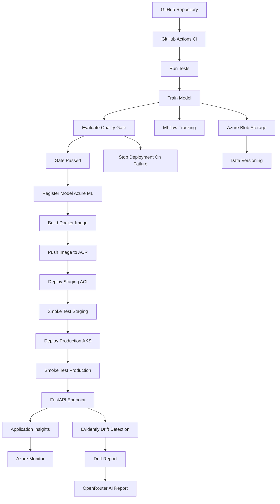

# Architecture

> Author: Bakhtiyar Khan · Date: 2026-06-27

This document describes the end-to-end architecture of the Iris MLOps pipeline.

## Overview

The system implements a complete, production-grade MLOps CI/CD pipeline on
Microsoft Azure. Code pushed to GitHub triggers Continuous Integration (tests,
training, quality gate, drift, AI report). Merges to `main` additionally trigger
Continuous Deployment (model registration, container build/push, staged
deployment to ACI, then production deployment to AKS), each protected by smoke
tests.

## Architecture diagram

## Components

| Component | Technology | Responsibility |
|-----------|------------|----------------|
| Data ingestion | scikit-learn, pandas, Azure Blob | Load Iris, hash, version, upload |
| Training | scikit-learn, MLflow | Train model, log params/metrics/artifacts |
| Quality gate | Python | Enforce minimum accuracy, block bad models |
| Model registry | Azure ML | Versioned, tagged model governance |
| Serving | FastAPI, uvicorn | REST inference (`/health`, `/predict`) |
| Packaging | Docker, ACR | Reproducible container image |
| Staging | Azure Container Instances | Fast, cheap pre-prod validation |
| Production | Azure Kubernetes Service | Scalable, resilient serving |
| Monitoring | Azure Monitor, App Insights | Logs, metrics, telemetry |
| Drift | Evidently AI (+ PSI fallback) | Detect data distribution shift |
| Reporting | OpenRouter LLM | Human-readable run summary |

## Design principles

1. **Graceful degradation** – every Azure/optional integration is lazy and
   skips cleanly when credentials or packages are missing, so the core flow runs
   on any laptop.
2. **Fail fast, fail safe** – the quality gate exits non-zero on bad models,
   halting deployment before anything reaches Azure.
3. **Twelve-factor config** – everything is configured via environment variables
   / GitHub Secrets; no secrets are committed.
4. **Promotion path** – staging (ACI) is always validated with smoke tests
   before production (AKS).

See [`pipeline_walkthrough.md`](pipeline_walkthrough.md) for a stage-by-stage
narrative and [`azure_setup.md`](azure_setup.md) for resource provisioning.
